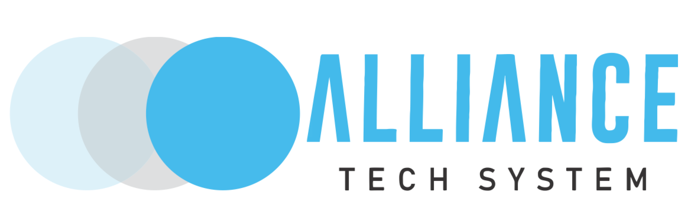

<div align="center">
  <br />
  <br />
  <br />
  
  <p align="center">
  <a href="https://alliancetechsystem.com/" target="blank">
    
  </a>
  </p>
  <br />
  <br />
  <br />
</div>

## Descrição
API de tracking dos casos de corona vírus no Brasil

## Fonte de dados
Atualmente o projeto possui duas fontes de dados:
 - https://www.worldometers.info/coronavirus/ - Onde a API busca os dados globais e nacionais
 - https://github.com/wcota/covid19br - Onde a API busca os dados estaduais e municipais
 
## Up and Running

### Configurações
- Criar uma cópia do arquivo `.env.sample` e renomea-lo para `.env`
- Alterar o valor de `PORT` para a porta que você deseja rodar a aplicação

### Rodando a API
Abra o o terminal na pasta do projeto e rode o comando abaixo:
```sh
yarn dev # ou npm run dev
```
## License

COVIDBR API is [WTFPL licensed](LICENSE).

